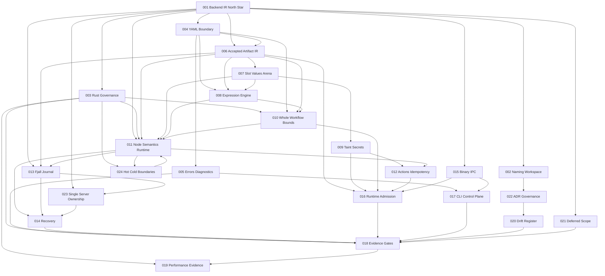

# ADR Dependency Graph

This graph maps the current ADR dependency structure.

## Critical Paths

| Path | Dependency chain |
|------|------------------|
| Accepted artifact path | `001 -> 004 -> 006 -> 010 -> 016 -> 018` |
| Durable recovery path | `001 -> 006 -> 011 -> 013 -> 014 -> 018` |
| Side-effect safety path | `001 -> 009 -> 012 -> 016 -> 013 -> 014` |
| IPC admission path | `001 -> 015 -> 016 -> 013 -> 005` |
| Performance truth path | `001 -> 003 -> 011 -> 024 -> 019 -> 018` |
| Scope control path | `001 -> 021 -> 022 -> 020` |
